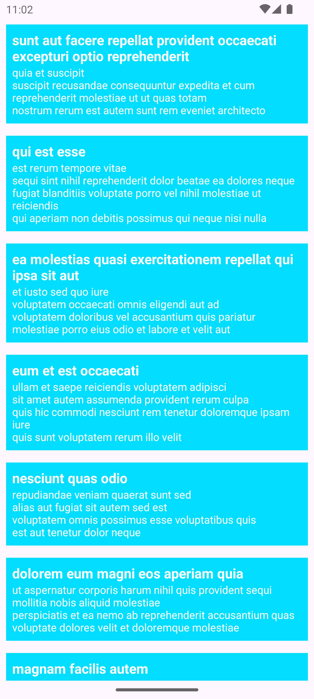

# HiltLearnMVVM

+ Bu projede, JSONPlaceHolder fake API servisini kullanarak basit birb GET isteğiyle Hilt Dependency Injection ve MVVM Project Structure öğrendim. 

## Temel Özellikler:

+ JSONPlaceHolder GET/posts isteğiyle gelen veriyi RecyclerView yardımı ile ekranda göstermek.

## Kurulum:

    git clone https://github.com/cusufcan/HiltLearnMVVM

## Ekran Görüntüleri:

<table>
    <tr>
        <td></td>
    </tr>
</table>

## Kullanılan Teknolojiler:

+ Kotlin
+ Hilt (Dependency Injection)
+ Retrofit
+ Gson Converter
+ Kapt
+ MVVM
+ LiveData

## Lisans:

    MIT
